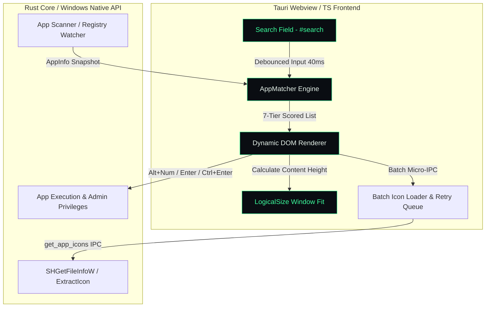

<div align="center">

  <!-- Logo / Header Banner -->
  <a href="https://github.com/yuanqiangwang/x-on">
    
  </a>

  <h1 align="center">xon</h1>

  <p align="center">
    <strong>⚡️ A Neon-Geek, Blazing-Fast Windows App Launcher Built with Tauri v2 & TypeScript.</strong>
    <br />
    <em>Ultra-lightweight, zero-latency window auto-resizing, and intelligent pinyin fuzzy matching.</em>
  </p>

  <!-- Badges -->
  <p align="center">
    <a href="https://github.com/yuanqiangwang/x-on/releases"></a>
    <a href="https://github.com/yuanqiangwang/x-on/blob/main/LICENSE"></a>
    <a href="https://github.com/yuanqiangwang/x-on/stargazers"></a>
  </p>

  <p align="center">
    <a href="#-key-features">Key Features</a> •
    <a href="#-architecture">Architecture</a> •
    <a href="#-matcher-algorithm">Matcher Engine</a> •
    <a href="#-quick-start">Quick Start</a> •
    <a href="#%EF%B8%8F-keyboard-shortcuts">Shortcuts</a>
  </p>

  ---
</div>

## 💡 What is xon?

**xon** is a minimalist, ultra-fast application launcher designed specifically for Windows power users[cite: 1, 3]. Built on top of **Tauri v2** and optimized vanilla TypeScript, **xon** delivers a classic "terminal-green" geek aesthetic with sub-millisecond response times, zero-latency window auto-sizing, and deep Chinese Pinyin matching capabilities[cite: 1, 2, 3].

> *"Press `Alt + Space`, type a few letters, hit Enter — launch anything instantly."*

<br />

## ✨ Key Features

- **⚡ Blazing Fast Search Engine:** Custom multi-tier matching supporting Chinese characters, full Pinyin, initial acronyms, and aliases[cite: 1, 2].
- **🎯 Exact-Word Homophone Suppression:** Smart literal-match priority that eliminates irrelevant pinyin candidates when exact Chinese characters are typed[cite: 2].
- **🎨 Neon-Geek UI & Font Customization:** High-contrast `#05060a` dark background paired with terminal green accents (`#3dff9e`) and customizable user fonts[cite: 1, 3].
- **📐 Dynamic Zero-Jitter Window Sizing:** Pixel-perfect programmatic window height adjustments calculated on the fly without UI layout shifts[cite: 1, 3].
- **🖼️ Smart Batch Icon Extraction & Emoji Fallbacks:** Parallel IPC batch extraction for application icons with retries, and high-DPI Segoe UI Emoji fallbacks for system settings URIs[cite: 1, 3].
- **🛡️ Native Windows Integration:** Right-click context menus for "Run as Administrator" and "Open File Location", background blur-hide, and single-instance wake hooks[cite: 1, 3].

<br />

## 🏗️ System Architecture



## 🔍 Matching & Ranking Engine (`AppMatcher`)

**xon** features a tailored 7-tier scoring algorithm that processes both display names and alternative system aliases in a single pass:

```
Tier 1: Exact Name Match          (e.g., "cmd" -> "cmd")
Tier 2: Name Prefix Match         (e.g., "post" -> "Postman")
Tier 3: Full Pinyin Prefix        (e.g., "dingding" -> "钉钉")
Tier 4: Word Initials Prefix      (e.g., "gc" -> "Google Chrome")
Tier 5: Pinyin Acronym Prefix     (e.g., "dd" -> "钉钉")
Tier 6: Substring / Full Search   (e.g., "panel" -> "Control Panel")
Tier 7: Fuzzy Subsequence Match   (e.g., "vsc" -> "Visual Studio Code")

```

## ⌨️ Keyboard Shortcuts & Controls


| Shortcut | Action | Description |
| --- | --- | --- |
| **`Alt + Space`** | **Wake Launcher** | Global shortcut to bring **xon** to front
| **`↑` \/ `↓`** | **Navigate Results** | Cycle through matching candidates
| **`Enter`** | **Launch Selected** | Execute target application or system URI
| **`Ctrl + Enter`** | **Run as Administrator** | Launch selected application with elevated privileges
| **`Alt + 1..9, 0`** | **Quick Launch** | Instantly launch result at position 1 to 10
| **`Esc`** | **Dismiss / Hide** | Close context menu or hide launcher window


## 🚀 Quick Start

### Prerequisites

* [Node.js](https://nodejs.org/) (v18+)
* [Rust](https://www.rust-lang.org/) (Tauri v2 requirement)

### Installation & Development

```bash
# 1. Clone the repository
git clone [https://github.com/yuanqiangwang/x-on.git](https://github.com/yuanqiangwang/x-on.git)
cd x-on

# 2. Install frontend dependencies
pnpm install

# 3. Run in Tauri development mode
pnpm tauri dev

```

### Build for Production

```bash
pnpm tauri build

```

## ⚙️ Configuration (`settings.json`)

Customize fonts and candidate limits on the fly without restarting:

```json
{
  "accelerator": "Alt+Space",
  "autostart": true,
  "font": "JetBrains Mono NF",
  "resultRows": 6
}

```

## 📄 License

This project is licensed under the [MIT License](https://www.google.com/search?q=LICENSE).

